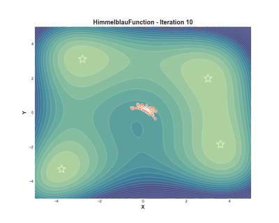
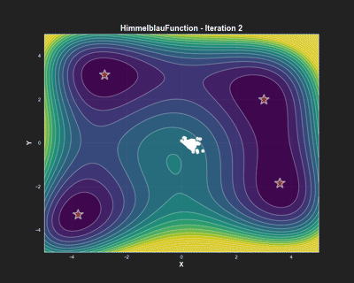
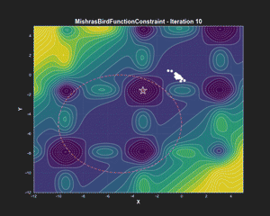
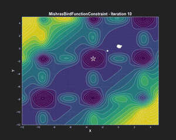

<div align="center">
  
</div>

# GFog - Gradient-Free Optimization via Gradients

**GFog** is a gradient-free optimization library using GANs to find solutions to black-box optimization problems — potentially discovering multiple optima.
It builds upon and improves the method proposed in the paper [A GAN based solver of black-box inverse problems](https://openreview.net/pdf?id=rJeNnm25US) (OptimGan)

## Quick Start

To run the example shown [below](#examples) run the following from the GFog base directory (the project uses [uv](https://docs.astral.sh/uv/)):

```python
# create and activate venv
uv venv
source .venv/bin/activate

# Install dependencies
bash install.sh

# Or, if you want to develop then install as
bash install.sh dev

# Run example for himmelblau function
python examples/testfunctions/example_himmelblau.py
```

## Improvements to OptimGan

**GFog** introduces two improvements over **OptimGan**:

1. Curiosity Loss

   **OptimGan** frequently stalled before converging, despite expectations that a GAN would explore and potentially uncover multiple solutions.
   **GFog** adds a curiosity loss that encourages exploration and often leads to discovering multiple solutions.

2. Hierarchically Sorted Buffer

   **GFog** supports multiple objectives using a hierarchically sorted buffer.
   For example, in a constrained optimization problem, each constraint can define a hierarchy level.
   This avoids the need to merge objectives of potentially vastly different magnitudes into a single loss
   It is as easy as letting the function to optimize return multiple values and tell the buffer to expect the
   number of returned values:

```python
# - the buffer expects two outputs from the function
# - sorting order is determined by the order in the list
# - we can give the levels names to make the targets explicit
buffer = Buffer(
    buffer_size=buffer_size,
    value_levels=Levels(["constraints", "fx"])
)
```

## Examples

### Curiosity applied on [Himmelblau's function](https://en.wikipedia.org/wiki/Himmelblau%27s_function)

<div align="center">
  <table>
    <tr>
      <td align="center">
        
        <br>
        <em>With Curiosity Loss</em>
      </td>
      <td align="center">
        
        <br>
        <em>Without Curiosity Loss</em>
      </td>
    </tr>
  </table>
</div>

<p align="center"><em>Comparison showing how curiosity loss helps discover all four minima but also taking more iterations</em></p>

### Constraints applied on [Mishra's Bird function](https://en.wikipedia.org/wiki/Himmelblau%27s_function)

<div align="center">
  <table>
    <tr>
      <td align="center">
        
        <br>
        <em>With Constraints</em>
      </td>
      <td align="center">
        
        <br>
        <em>Without Constraints</em>
      </td>
    </tr>
  </table>
</div>

<p align="center"><em>Comparison show how adding constraints effect the optimization</em></p>

---

## Code Example

TODO

## How it works

TODO: more detail

- **Generator**: Proposes samples
- **Samples** are evaluated via the function to be optimized
- **Buffer**: Maintains best solutions found so far
- **Discriminator**: discriminates between generated samples and samples in the buffer
- **Curiosity Loss**: Encourages exploration of unexplored regions
