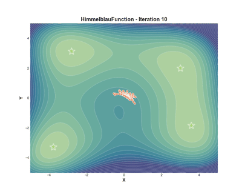
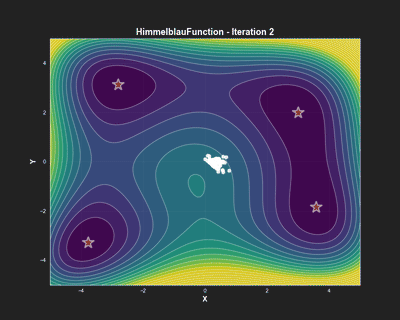
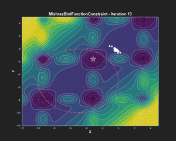
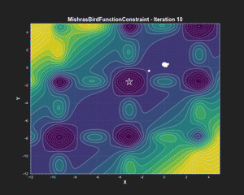

<div align="center">
  
</div>

# GFog - Gradient-Free Optimization via Gradients

**GFog** is a gradient-free optimization library that uses a GAN-like training loop to solve black-box optimization problems and, in favorable cases, discover multiple optima.
It builds on the idea from [A GAN based solver of black-box inverse problems](https://openreview.net/pdf?id=rJeNnm25US) (OptimGan), with a stronger buffer abstraction and optional curiosity losses.

## Quick Start

From the repository root:

```bash
uv venv
source .venv/bin/activate
bash install.sh dev
python examples/testfunctions/example_himmelblau.py
```

## Main ideas

GFog combines four pieces:

1. **Generator** proposes candidate solutions.
2. **Black-box objective** evaluates those candidates.
3. **Buffer** keeps the best candidates seen so far.
4. **Discriminator** learns to distinguish current generator samples from elite buffer samples, providing gradients back to the generator.

Optionally, a **curiosity loss** encourages the generator to spread out instead of collapsing too early.

## Current experiment standard

For new black-box optimization experiments, use the repo-wide defaults in
[`EXPERIMENT_STANDARDS.md`](EXPERIMENT_STANDARDS.md). In short: prefer ranked
objectives over plain GAN losses, use one ranker step, start from Muon/Muon with
TTUR-style learning rates, and normalize generator outputs before distance-based
curiosity whenever the decoder is shift/scale invariant.

The reusable wrapper is:

```python
from gfog.models import OutputNormalizer

G = OutputNormalizer(G, "centered_l2")
```

Do not apply that blindly to every task. It is standard for score-vector
decoders such as argsort, sorted-material topology, and argmax sequence logits;
task-specific decoders may need their own normalization.

## Improvements over OptimGan

### 1. Curiosity loss

OptimGan can stall or collapse toward only part of the solution set. GFog supports curiosity losses that encourage broader exploration.

**Recommended default:** `WangIsolaUniformity`

This is the curiosity loss used in the main example and the one recommended for new code.

Legacy curiosity losses (`CuriosityLoss`, `CuriositySiglipLoss`) are still available for compatibility, but they are considered legacy APIs.

### 2. Hierarchically sorted buffer

GFog supports multi-objective and constrained optimization via a lexicographically sorted buffer.
Instead of collapsing all objectives into one scalar, you can represent priorities explicitly.

For simple multi-level sorting:

```python
from gfog.buffer import Buffer, Levels

buffer = Buffer(
    buffer_size=128,
    value_levels=Levels(["constraints", "fx"]),
)
```

For more structured constraint/objective hierarchies, use ladder levels:

```python
from gfog.buffer import Levels, Rung

levels = Levels.ladder(
    [
        Rung.minimize("constraint", [5.0, 2.0]),
        Rung.minimize("fx", [10.0, 1.0], open_last=True),
    ]
)
```

## Buffer value layout

`Buffer.insert_many()` accepts three formats:

- **single-level scalar list**
  ```python
  values = [1.2, 0.9, 3.4]
  ```
- **row-major multi-level**: one entry per sample
  ```python
  values = [[0.1, 10.0], [0.0, 8.0], [0.3, 12.0]]
  ```
- **column-major multi-level**: one entry per level
  ```python
  values = [[0.1, 0.0, 0.3], [10.0, 8.0, 12.0]]
  ```

Row-major is recommended for new code.

## Minimal example

```python
import torch
from torch.nn import BCEWithLogitsLoss

from gfog.buffer import Buffer
from gfog.curiosity import WangIsolaUniformity, WangIsolaUniformityConfig
from gfog.models import MLP
from gfog.opt import DefaultOpt, components
from gfog.opt.latents_sampler import LatentSamplerLambda


def sphere(x: torch.Tensor) -> torch.Tensor:
    return (x**2).sum(dim=-1)


batch_size = 64
latent_dim = 10
input_dim = 2

device = torch.device("cpu")

fn = components.Fn(
    f=sphere,
    input_dim=input_dim,
    device=device,
    dtype=torch.float32,
)

buffer = components.BufferComp(B=Buffer(buffer_size=2 * batch_size))

G = MLP(input_dim=latent_dim, output_dim=input_dim, hidden_dims=[32]).to(device)
D = MLP(input_dim=input_dim, output_dim=1, hidden_dims=[32]).to(device)

gan = components.GAN(
    G=G,
    D=D,
    loss=BCEWithLogitsLoss(),
    curiosity_loss=WangIsolaUniformity(
        WangIsolaUniformityConfig(use_buffer=True, weight=10.0),
        buffer=buffer.B,
    ),
    latent_dim=latent_dim,
    optimizerG=torch.optim.Adam(G.parameters(), lr=1e-2),
    optimizerD=torch.optim.Adam(D.parameters(), lr=1e-1),
    latent_sampler=LatentSamplerLambda(
        lambda b, d: torch.randn(b, d),
        b=batch_size,
        d=latent_dim,
    ),
    device=device,
    dtype=torch.float32,
)

opt = DefaultOpt(
    components.OptComponents(
        fn=fn,
        gan=gan,
        batch_size=batch_size,
        buffer=buffer,
        discriminator_steps=1,
        elite_sampling="random_top_k",
        elite_pool_size=2 * batch_size,
    )
)

opt.optimize(200, verbose=True)
print("best value:", buffer.B.get_value(0))
print("best point:", buffer.B.get_top_k(1).squeeze(0))
```

## Optimizer options

`OptComponents` now supports a few useful knobs:

- `discriminator_steps`: how many discriminator updates to run per generator update
- `elite_sampling`:
  - `"random_top_k"` (default): sample discriminator positives randomly from the elite pool
  - `"top_k"`: always use the current top batch deterministically
- `elite_pool_size`: size of the elite pool used for random sampling
- `weight_clip`: critic weight clipping value used by `WGANOpt`
- `gradient_penalty_weight`: gradient penalty coefficient used by `WGANGPOpt`

## Custom optimizers

GFog supports two extension styles:

1. **Subclass `BaseOpt`** when you want to reuse the standard optimization loop and buffer initialization.
2. **Implement `OptimizerProtocol`** when you want an out-of-tree optimizer without inheriting from GFog internals.

Minimal subclass example:

```python
import torch
from gfog.opt import BaseOpt


class MyOpt(BaseOpt):
    def propose(self) -> torch.Tensor:
        z = self.gan.latent_sampler().to(self.gan.device, self.gan.dtype)
        return self.gan.G(z)

    def evaluate(self, proposals: torch.Tensor) -> None:
        values = self.fn.f(proposals.detach().to(self.fn.device, self.fn.dtype))
        self.buffer.B.insert_many(list(proposals.detach()), list(values))
```

If you do not want to subclass `BaseOpt`, a custom external class only needs to expose the minimal `OptimizerProtocol` surface:

- `step() -> None`
- `optimize(...) -> torch.Tensor`

Built-in optimizers operate on arbitrary `torch.nn.Module` instances, so `G` and `D` can be defined entirely outside `src/gfog/models`.

Built-in optimizers currently include:

- `DefaultOpt` — vanilla GAN / BCE-style training
- `HingeGANOpt` — hinge-loss GAN training
- `LSGANOpt` — least-squares GAN training
- `QuantileRankedDefaultOpt` — dense rank-target discriminator training on the buffer
- `HybridContextualUtilityRankerOpt` — contextual Plackett-Luce ranker plus local utility calibration
- `WGANOpt` — Wasserstein critic with weight clipping
- `WGANGPOpt` — Wasserstein critic with gradient penalty

## Examples

### Curiosity on Himmelblau

<div align="center">
  <table>
    <tr>
      <td align="center">
        
        <br>
        <em>With curiosity loss</em>
      </td>
      <td align="center">
        
        <br>
        <em>Without curiosity loss</em>
      </td>
    </tr>
  </table>
</div>

<p align="center"><em>Curiosity can help cover multiple minima, though it may require more iterations.</em></p>

### Constraints on Mishra's Bird function

<div align="center">
  <table>
    <tr>
      <td align="center">
        
        <br>
        <em>With constraints</em>
      </td>
      <td align="center">
        
        <br>
        <em>Without constraints</em>
      </td>
    </tr>
  </table>
</div>

<p align="center"><em>Hierarchical buffer levels let constraints dominate objective ranking cleanly.</em></p>

## Testing

```bash
pytest -q
```

Current tests cover:

- buffer insert/sort/access behavior
- ladder level transforms
- curiosity loss gradient flow basics
- scheduler edge cases
- Rust buffer behavior through the Python wrapper
